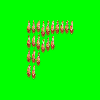

openfl-issue-scrollRect
=======================

Issue demonstration project.

Issue is special case of those conditions:

- Use `canvas` renderer for openfl back-end
- Use `scrollRect` on `Bitmap`

When using that way, scrollRect is ignored and full BitmapData is drawn scaled down into scrollRect area.

Actual result:
--------------

Expected result:
----------------

Known workarounds
-----------------

- Use webgl renderer
- Put bitmap into container with scrollRect
- Create another BitmapData using copyPixels and don't use scrollRect at all

How to run
----------

You can serve [pub](pub) subfolder using any http server, after that, navigate to [.../index.html](pub/index.html)

... or just [run it using htmlpreview.github.io](https://htmlpreview.github.io/?https://github.com/mrchnk/openfl-issue-scrollRect/blob/master/pub/index.html)

Issue
-----

Track issue status at https://github.com/openfl/openfl/issues/2446